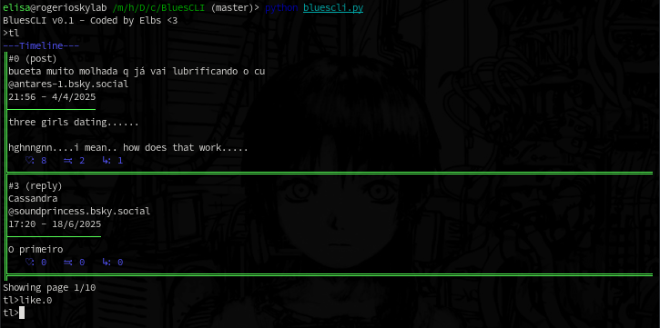

# BluesCLI
BluesCLI is a text mode only client for BlueSky, the project started as a way to use the network in an jailbroken iPhone 5S, as it uses iOS 12.5 and the official bsky app doesn't support it :(

## Dependencies
[Chitose](https://github.com/mnogu/chitose) 
[Pytz](https://pypi.org/project/pytz/) 
[Dateutil](https://github.com/dateutil/dateutil) 

## Usage
Just clone the repo:

    git clone https://github.com/elbsdev/BluesCLI.git
    cd BluesCLI

Install the dependencies manually or type:

    pip install -r requirements.txt

And run the program by typing:

    python bluescli.py

When running for the first time, you'll be asked to input your credentials, you must input your full handle. Ex: foo.bsky.social instead of just foo  
After you login, your session will be stored in the config.json file.

### Basic commands
config - view and change config variables  
help - show the command list  
tl - enter timeline mode, posts will  
quit - save the config file and quit